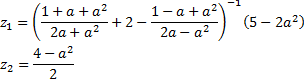

# Основы программирования. Лабораторная работа №1
[](https://travis-ci.org/z8432k/feodorov-base-coding-lab1-19)

## Вычисление математических выражений

### Вариант 19



Сборка и запуск:

```bash
make
./bin/math_expressions
```
